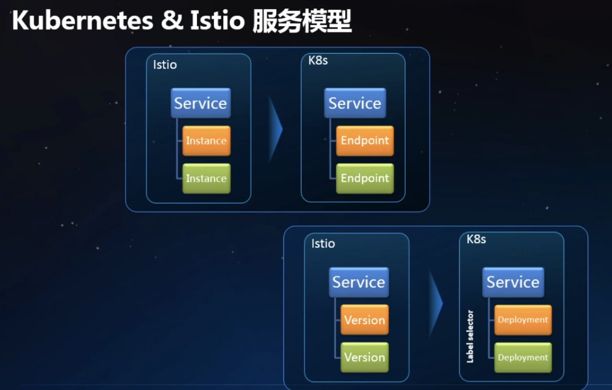
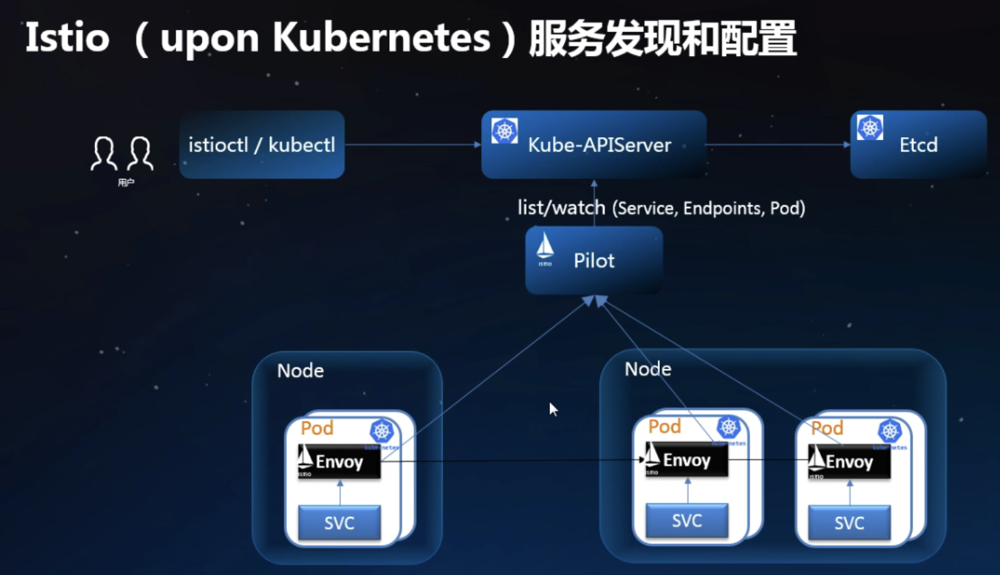
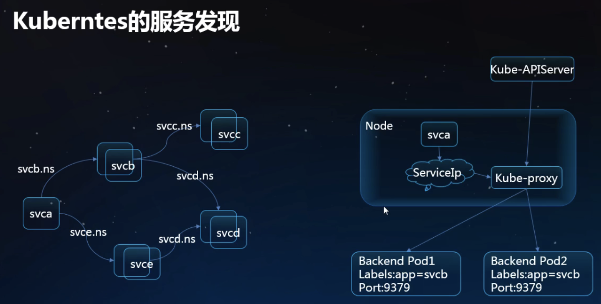

# ServiceRegistry
这个包里定义了服务发现的接口，用来对接数据平面的 envoy 组件。当 envoy 接收到被代理服务的对外请求时，会向数据平面发起**服务发现**请求。

envoy 连接上 Pilot 中的 [DiscoveryServer](../../pkg/xds/discovery.go)（一个 RPC server），获取服务信息。

## K8s
截止目前的版本，Istio 中服务发现基本上是基于 K8s 来实现的。下面是一个服务模型的对照图：

上述模型基本上是一一对应的。部署在 K8s 上的 Istio 如下：

Istio 从 K8s 中获取服务信息，将服务信息转换成服务发现的标准格式 [Service](../../pkg/model/service.go)，并返回给 envoy。 Istio 使用 List/Watch 机制，用来获取 K8s 中的 Service/Endpoints。

K8s 实际也是具备服务发现能力的：

其中 kube-proxy 组件类似于 envoy，API Server 则类似与 Pilot。但是 K8s 无法提供微服务场景下更加精细的控制，如：超时、重试、熔断、限流等。